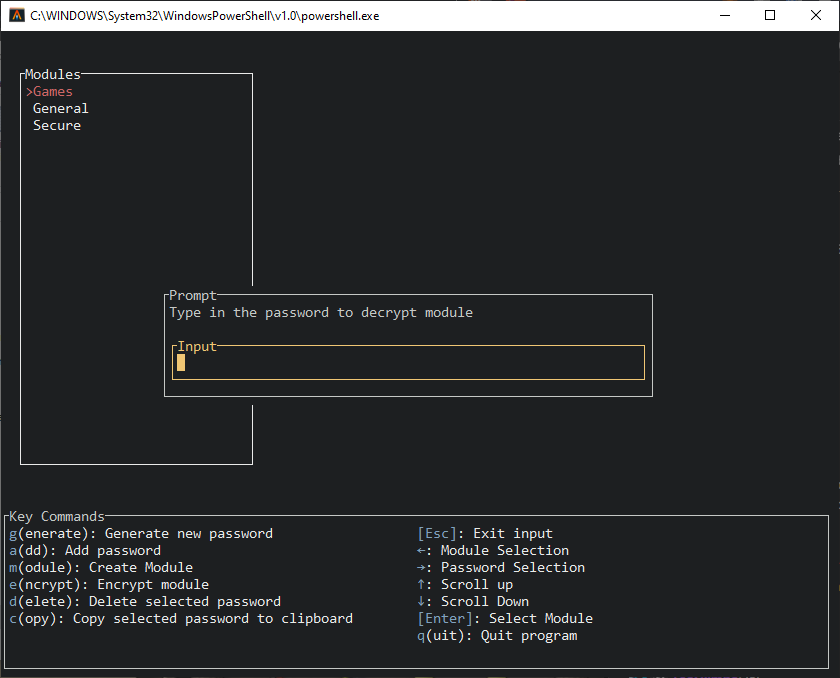
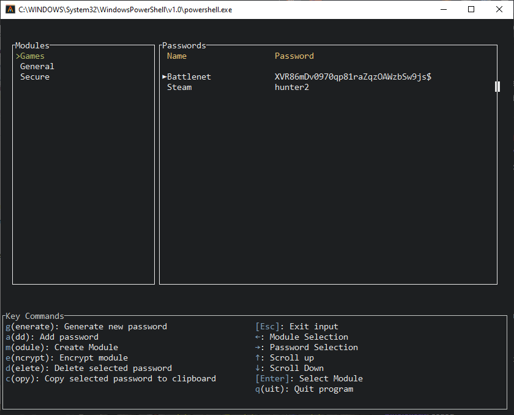

# pwmanager_tui
A terminal based password manager
## Features
- Store passwords in modules to easily distinguish between them
- Encrypt modules with password for safer storage of passwords. Only need to memorize one instead of several.
- Copy selected password to clipboard to quickly use it.
- Generate secure random passwords or import existing password.
- Portable. Simply copy the the contents of "~/.pwmanager" directory to other computer and run the program

## Previews
### Decrypting a module

### Displaying the decrypted passwords

